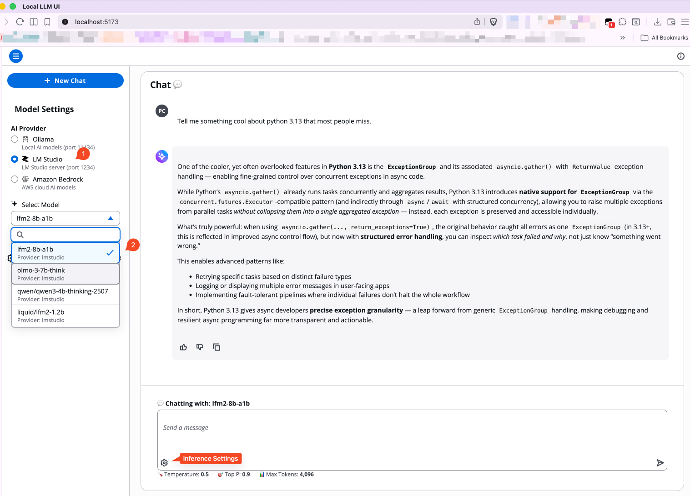
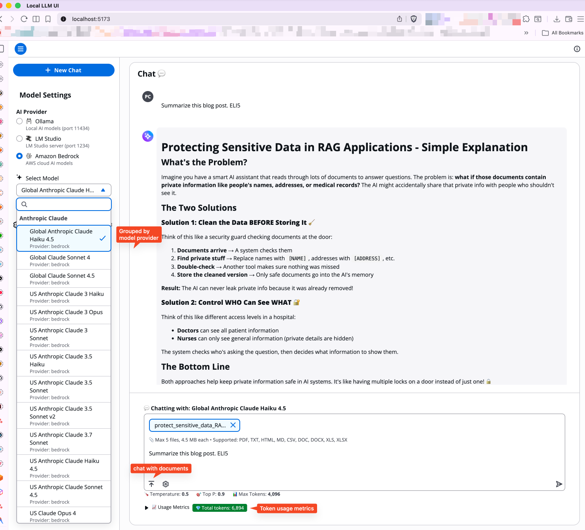

# Local LLM UI

[](https://opensource.org/licenses/MIT)
[](https://www.typescriptlang.org/)
[](https://reactjs.org/)
[](https://vitejs.dev/)
[](CONTRIBUTING.md)

A modern, responsive UI for interacting with Large Language Models (LLMs). Built with React, TypeScript, Vite, and AWS Cloudscape Design System, this application provides a beautiful interface for chatting with AI models through Ollama, LM Studio, and Amazon Bedrock.

## Features

- **Modern UI**: Built with AWS Cloudscape Design System for a professional, accessible interface
- **Multiple AI Providers**: Support for Ollama, LM Studio, and Amazon Bedrock
- **Real-time Streaming**: Stream responses from AI models in real-time
- **Model Configuration**: Adjust temperature, top-p, and max tokens for fine-tuned responses
- **User Preferences**: Persistent settings for preferred AI provider and custom avatar initials
- **Visual Provider Indicators**: Clear icons showing which AI provider is active
- **Document Upload**: Upload documents (PDF, TXT, HTML, MD, CSV, DOC, DOCX, XLS, XLSX) with Bedrock models
- **Usage Metrics**: View token usage and latency for Bedrock requests
- **Chat History**: Manage multiple chat sessions with automatic history tracking *(Coming soon)*
- **Responsive Design**: Works seamlessly across desktop and mobile devices
- **Dark/Light Mode**: Automatic theme support through Cloudscape

## Prerequisites

Before running this application, ensure you have the following installed:

- **Node.js**: Version 18.x or higher
- **npm**: Version 9.x or higher (comes with Node.js)
- **AI Provider** (at least one):
  - [Ollama](https://ollama.ai) - Local AI models (recommended)
  - [LM Studio](https://lmstudio.ai) - Alternative local AI platform
  - [Amazon Bedrock](https://aws.amazon.com/bedrock/) - AWS cloud AI service (requires AWS credentials)

## Installation

1. Clone the repository:

   ```bash
   git clone https://github.com/praveenc/local-llm-ui.git
   cd local-llm-ui
   ```

2. Install dependencies:

   ```bash
   npm install
   ```

## AI Provider Setup

### Option 1: Ollama (Recommended)

1. Download and install Ollama from [ollama.com](https://ollama.com)

2. Pull a model (e.g., qwen3-8b):

   ```bash
   ollama pull qwen3-8b-8k:latest
   ```

   ```bash
   # or an ollama cloud model
   ollama pull minimax-m2:cloud
   ```

3. Verify Ollama is running:

   ```bash
   ollama list
   ```

   Ollama runs on `http://localhost:11434` by default.

### Option 2: LM Studio

1. Download and install LM Studio from [lmstudio.ai](https://lmstudio.ai)

2. Download a model through the LM Studio interface

3. Start the local server:
   - Open LM Studio
   - Go to the "Developer" or "Server" tab
   - Click "Start Server"
   - Ensure it's running on port `1234`

4. (Optional) Enable JIT Loading:
   - Go to Developer → Server Settings
   - Enable "JIT Loading" to load models on-demand

### Option 3: Amazon Bedrock

1. **Set up AWS credentials** using one of these methods:

   **Option A: Environment Variables**
   ```bash
   export AWS_ACCESS_KEY_ID=your_access_key_id
   export AWS_SECRET_ACCESS_KEY=your_secret_access_key
   export AWS_REGION=us-west-2  # or your preferred region
   ```

   **Option B: AWS CLI**
   ```bash
   aws configure
   ```

   **Option C: AWS Credentials File**
   Create `~/.aws/credentials`:
   ```ini
   [default]
   aws_access_key_id = your_access_key_id
   aws_secret_access_key = your_secret_access_key
   ```

2. **Ensure IAM Permissions**: Your AWS user/role needs these permissions:
   - `bedrock:ListInferenceProfiles`
   - `bedrock:InvokeModel` or `bedrock:InvokeModelWithResponseStream`

3. **Request Model Access** (if needed):
   - Go to AWS Bedrock console
   - Navigate to "Model access"
   - Request access to desired models (e.g., Claude, Llama)

4. **Verify Setup**:
   ```bash
   aws bedrock list-foundation-models --region us-west-2
   ```

## Running the Application

### Development Mode

Start the development server with hot module replacement:

```bash
npm run dev
```

The application will be available at `http://localhost:5173`

### Production Build

Build the application for production:

```bash
npm run build
```

Preview the production build:

```bash
npm run preview
```

## Usage

### Getting Started

1. **Start the Application**: Run `npm run dev`

2. **Select AI Provider**:
   - Open the sidebar (Model Settings)
   - Choose between Ollama, LM Studio, or Amazon Bedrock
   - The app will automatically detect available models

3. **Select a Model**:
   - Choose from the dropdown list of available models
   - Models are filtered to show only chat-capable models

4. **Start Chatting**:
   - Type your message in the input field
   - Press Enter or click the send button
   - Watch the AI response stream in real-time

### Model Configuration

Adjust model parameters in the expandable settings panel:

- **Temperature** (0.0 - 2.0): Controls randomness
  - Lower values (0.1-0.5): More focused and deterministic
  - Higher values (0.8-1.5): More creative and varied

- **Top P** (0.0 - 1.0): Controls diversity via nucleus sampling
  - Lower values: More focused responses
  - Higher values: More diverse responses

- **Max Tokens**: Maximum length of the response
  - Default: 4096 tokens
  - Adjust based on your needs and model capabilities

### Managing Chats

- **New Chat**: Click the "New Chat" button in the sidebar to start fresh
- **Clear History**: Clears the current conversation while keeping the session

### User Preferences

Customize your experience with persistent preferences:

1. **Access Preferences**: Click the settings icon at the bottom of the sidebar
2. **Preferred Provider**: Set your default AI provider (Ollama, LM Studio, or Bedrock)
   - The app will automatically select this provider on startup
3. **Avatar Initials**: Customize your chat avatar with 2 alphanumeric characters
   - Automatically converted to uppercase
   - Appears next to your messages in the chat
4. **Save**: Click "Save" to persist your preferences
   - Settings are stored in browser localStorage
   - Preferences persist across sessions

### Document Upload (Bedrock Only)

When using Amazon Bedrock models, you can upload documents:

1. Click the attachment icon in the chat input
2. Select up to 5 files (max 4.5 MB each)
3. Supported formats: PDF, TXT, HTML, MD, CSV, DOC, DOCX, XLS, XLSX
4. Send your message with the attached documents
5. The AI will analyze and respond based on the document content

### Usage Metrics (Bedrock Only)

For Bedrock models, view detailed usage metrics:
- **Input Tokens**: Tokens in your prompt
- **Output Tokens**: Tokens in the AI response
- **Total Tokens**: Combined token count
- **Latency**: Response time in milliseconds

Metrics appear in an expandable section below the chat input.

## Project Structure

```text
local-llm-ui/
├── src/
│   ├── components/
│   │   ├── chat/              # Chat-related components
│   │   │   ├── ChatContainer.tsx
│   │   │   ├── ChatInputPanel.tsx
│   │   │   ├── MessageList.tsx
│   │   │   └── ...
│   │   └── layout/            # Layout components
│   ├── layout/
│   │   ├── BaseAppLayout.tsx  # Main app layout
│   │   └── SideBar.tsx        # Model settings sidebar
│   ├── services/
│   │   ├── api.ts             # API service orchestrator
│   │   ├── ollama.ts          # Ollama integration
│   │   ├── lmstudio.ts        # LM Studio integration
│   │   ├── bedrock.ts         # Amazon Bedrock integration
│   │   └── types.ts           # TypeScript types
│   ├── utils/
│   │   ├── preferences.ts     # User preferences management
│   │   └── ...                # Other utility functions
│   └── main.tsx               # Application entry point
├── server/
│   └── bedrock-proxy.ts       # Bedrock proxy server
├── public/                    # Static assets
├── vite.config.ts             # Vite configuration
└── package.json               # Dependencies and scripts
```

## Configuration

### Environment Variables

The application uses Vite's environment variable system. Create a `.env` file in the root directory if you need custom configuration:

```env
# Optional: Custom Ollama URL
VITE_OLLAMA_URL=http://localhost:11434

# Optional: Custom LM Studio URL
VITE_LMSTUDIO_URL=http://localhost:1234

# Optional: AWS Configuration (if not using AWS CLI or credentials file)
AWS_ACCESS_KEY_ID=your_access_key_id
AWS_SECRET_ACCESS_KEY=your_secret_access_key
AWS_REGION=us-west-2
```

### Proxy Configuration

The Vite development server proxies requests to AI services:

- `/api/ollama` → `http://localhost:11434`
- `/api/lmstudio` → `http://localhost:1234`
- `/api/bedrock` → Handled by server-side proxy (AWS SDK)

This configuration is in `vite.config.ts` and handles CORS automatically. The Bedrock proxy runs server-side to securely handle AWS credentials.

## Troubleshooting

### No Models Available

**Problem**: The model dropdown is empty

**Solutions**:

- **Ollama**: Ensure Ollama is running and you've pulled at least one model

  ```bash
  ollama list
  ollama pull llama2
  ```

- **LM Studio**: Ensure the server is running and a model is loaded or JIT Loading is enabled

- **Amazon Bedrock**: Verify AWS credentials are configured and you have model access

### Connection Failed

**Problem**: "Cannot connect" error messages

**Solutions**:

- **Ollama/LM Studio**: Verify the AI service is running on the correct port
- **Ollama/LM Studio**: Check firewall settings
- **Ollama/LM Studio**: Ensure no other application is using the port
- **Ollama/LM Studio**: Restart the AI service
- **Bedrock**: Verify AWS credentials are configured correctly
- **Bedrock**: Check IAM permissions for Bedrock access
- **Bedrock**: Ensure you have requested model access in AWS console

### Slow Responses

**Problem**: AI responses are very slow

**Solutions**:

- Use a smaller model (e.g., `llama2:7b` instead of `llama2:70b`)
- Reduce `max_tokens` setting
- Ensure your system meets the model's hardware requirements
- Close other resource-intensive applications

## Development

### Available Scripts

- `npm run dev` - Start development server
- `npm run build` - Build for production
- `npm run preview` - Preview production build
- `npm run lint` - Run ESLint

### Code Style

This project uses:

- **ESLint**: For code linting
- **TypeScript**: For type safety
- **Cloudscape Design System**: For UI components

### Adding New Features

1. Follow the existing component structure
2. Use Cloudscape components for consistency
3. Maintain TypeScript types
4. Test with Ollama, LM Studio, and Bedrock (if applicable)

## Screenshots

### Main Interface


*Chat interface with model selection, settings, and real-time streaming responses*

<!-- Add more screenshots here as you create them:
### Settings Panel


### Chat in Action

-->

## Technologies Used

- **React 19**: UI framework
- **TypeScript**: Type safety
- **Vite**: Build tool and dev server
- **Cloudscape Design System**: AWS UI component library
- **AWS SDK**: Bedrock integration (@aws-sdk/client-bedrock, @aws-sdk/client-bedrock-runtime)
- **React Markdown**: Markdown rendering in chat

## Screenshots

### Ollama, LMStudio Support


### Amazon Bedrock features




## License

This project is licensed under the MIT License - see the [LICENSE](LICENSE) file for details.

## Support

For issues or questions:

1. Check the troubleshooting section
2. Verify your AI provider is properly configured
3. Check the browser console for error messages
4. Ensure all dependencies are installed correctly

## Acknowledgments

- UI built with [AWS Cloudscape Design System](https://cloudscape.design/)
- Supports [Ollama](https://ollama.ai), [LM Studio](https://lmstudio.ai), and [Amazon Bedrock](https://aws.amazon.com/bedrock/)
- Powered by [Vite](https://vitejs.dev/) and [React](https://react.dev/)
